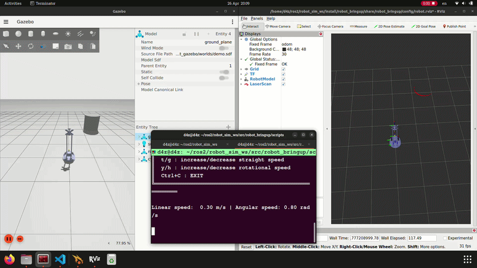
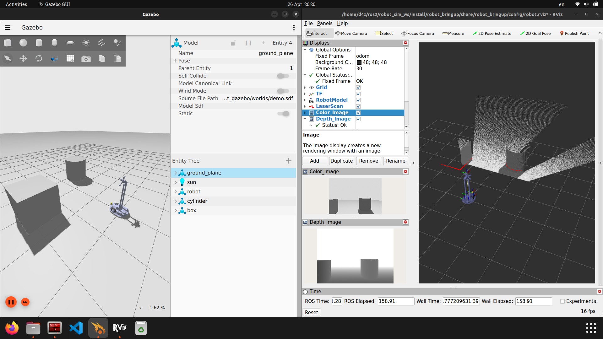
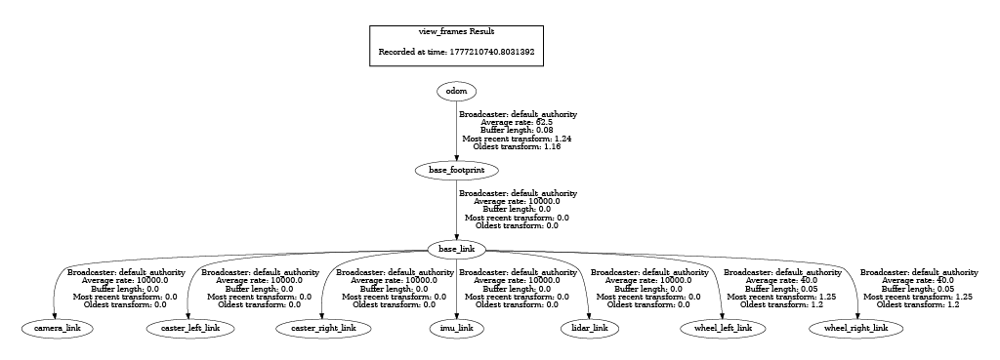

Test

# 🤖 Robot Simulation

A ROS2 differential drive robot simulation, built on **ROS2 Humble** and **Ignition Fortress (Gazebo 6.17)**.


---

## 📷 Preview

 





---

## 📦 Package Structure

```
robot_ws/
└── src/
    ├── images/                     # Images, GIF
    │
    ├── robot_bringup/              # Launch files, configs
    │   ├── config/
    │   │   ├── robot.rviz
    │   │   └── robot_bridge.yaml
    │   ├── launch/
    │   │   └── robot.launch.py
    │   └── scripts/
    │       └── teleop_keyboard.py
    │
    ├── robot_description/          # URDF/Xacro, meshes
    │   ├── hooks/
    │   ├── meshes/
    │   └── urdf/
    │       └── robot.xacro
    │
    └── robot_gazebo/               # Simulation worlds
        ├── hooks/
        └── worlds/
            └── demo.sdf
```

---

## 🤖 Robot Specifications

|  Parameter           | Value      |
|:---------------------|-----------:|
|  Wheel Radius        | 0.0396 m   |
|  Wheel Separation    | 0.288 m    |
|  Max Linear Velocity | 1.0 m/s    |
|  Max Angular Velocity| 1.0 rad/s  |

### 📡 Sensors

|  Sensor       |   Type           |   Topic         | Rate   |
|:--------------|:-----------------|:----------------|-------:|
|  IMU          |   9-DOF IMU      |   `/imu/data`   | 50 Hz  |
|  LiDAR        |   Hokuyo UST-10  |   `/lidar/data` | 10 Hz  |
|  Depth Camera | Intel RealSense D435 | `/camera/*` | 5 Hz   |

---

## 🔧 Prerequisites

- **OS:** Ubuntu 22.04
- **ROS2:** Humble
- **Gazebo:** Ignition Fortress

Install ROS2 Humble by following the [official guide](https://docs.ros.org/en/humble/Installation.html).

Install Ignition Fortress:
```bash
sudo apt-get install ignition-fortress
```

Install ROS-Gazebo bridge:
```bash
sudo apt install ros-humble-ros-gz
```

---

## 🚀 Installation

**1. Create workspace and clone the repository:**
```bash
mkdir -p ~/robot_ws/src && cd ~/robot_ws/src
git clone https://github.com/ngducdatRb/ROS2-Autonomous-Mobile-Robot-Simulation.git
```

**2. Install dependencies:**
```bash
cd ~/robot_ws
rosdep install --from-paths src --ignore-src -r -y
```

**3. Build:**
```bash
colcon build
source install/setup.bash
```

---

## ▶️ Usage

### Launch Simulation

```bash
ros2 launch robot_bringup simulation.launch.py
```

This will start:
- **Ignition Fortress** with the demo world
- **Robot State Publisher** — publishes TF transforms
- **ROS-GZ Bridge** — bridges topics between Gazebo and ROS2
- **RViz2** — visualization

### Teleoperate the Robot

```bash
# Move to teleop script folder
cd ~/robot_ws/src/robot_bringup/scripts

# Run teleop node
python3 teleop_keyboard.py
```

### Monitor Topics

```bash
# Check odometry
ros2 topic echo /odom

# Check LiDAR
ros2 topic echo /lidar/data

# Check IMU
ros2 topic echo /imu/data
```

---

## 🌉 ROS-GZ Bridge Topics

| ROS Topic                  | Direction      |        GZ Topic               |
|----------------------------|----------------|-------------------------------|
| `/clock`                   | GZ → ROS       | `/clock`                      |
| `/tf`                      | GZ → ROS       | `/tf`                         |
| `/tf_statics`              | GZ → ROS       | `/tf_static`                  |
| `/odom`                    | GZ → ROS       | `/model/robot/odometry`       |
| `/cmd_vel`                 | ROS → GZ       | `/cmd_vel`     |
| `/imu/data`                | GZ → ROS       | `/imu/data`    |
| `/lidar/data`              | GZ → ROS       | `/lidar/data`  |
| `/joint_states`            | GZ → ROS       | `/world/demo/model/robot/joint_state`                                        |
| `/camera/color/image_raw`  | GZ → ROS       | `/world/demo/model/robot/link/base_footprint/sensor/rgbd_camera/image`       |
| `/camera/depth/image_raw`  | GZ → ROS       | `/world/demo/model/robot/link/base_footprint/sensor/rgbd_camera/depth_image` |
| `/camera/camera_info`      | GZ → ROS       | `/world/demo/model/robot/link/base_footprint/sensor/rgbd_camera/camera_info` |
| `/camera/depth/points`     | GZ → ROS       | `/world/demo/model/robot/link/base_footprint/sensor/rgbd_camera/points`      |

