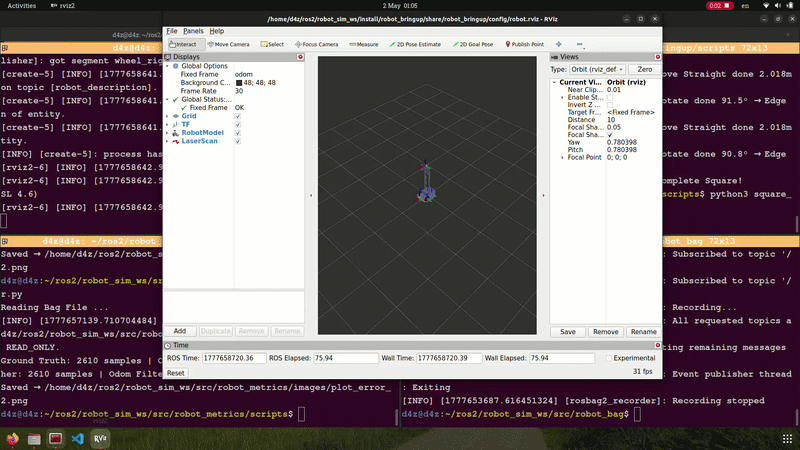
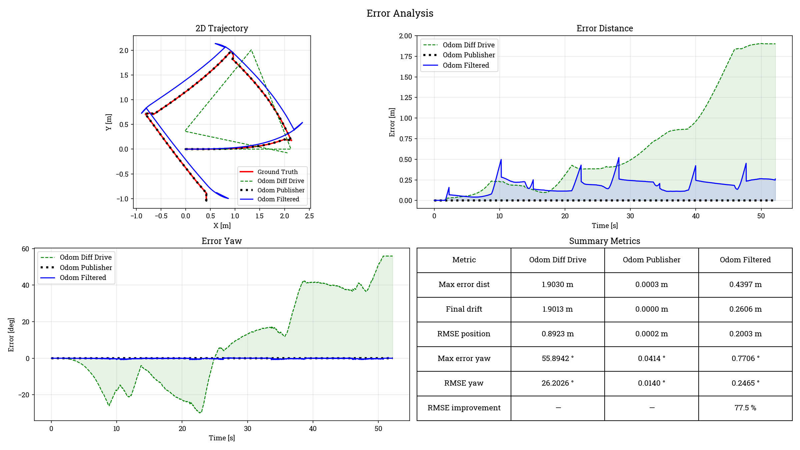
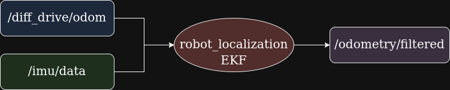

# 🤖 Robot Simulation

A ROS2 differential drive robot simulation, built on **ROS2 Humble** and **Ignition Fortress (Gazebo 6.17)**.

Provide a complete simulation pipeline

Focus on **odometry drift analysis**, **quantitative evaluation of localization errors**


---

## 📷 Preview

### Odometry Error Analysis







---

## 📊 Key Features

- 🔹 Differential drive robot simulation in Ignition Gazebo  
- 🔹 ROS2 integration with full sensor stack (IMU, LiDAR, Depth Camera)  
- 🔹 Real-time teleoperation and visualization (RViz2)  
- 🔹 **Use the `robot_localization` package to fuse wheel odometry and IMU data**
- 🔹 **Odometry drift analysis using rosbag data**  
- 🔹 **Automated error evaluation between wheel odometry and ground truth**
- 🔹 Visualization of:
  - 2D trajectory comparison  
  - Euclidean distance drift  
  - Yaw (heading) error  
  - Metric table

---

## 📈 Odometry Drift Analysis

In mobile robotics, **wheel odometry is inherently prone to drift** due to:
- wheel slip  
- numerical integration errors  
- sensor noise  

This repository includes a dedicated evaluation pipeline that:

1. Use the `robot_localization` package to fuse wheel odometry and IMU data

2. Records both:
   - Ground truth trajectory (`/model/robot/pose`)
   - Wheel odometry (`/diff_drive/odom`)
   - Odometry Publisher plugin (`/odom_publisher/odom`)
   - Odometry Filtered EKF - robot_localization pkg (`/odometry/filtered`)

3. Aligns trajectories in time and interpolates data

4. Computes key error metrics: 
   - Euclidean distance drift error
   - Yaw error  
   - RMSE yaw & distance

5. Generates visualization plots for analysis

This allows users to **quantitatively assess odometry performance** in simulation.

**Result**: After simulation, EKF produced filtered odometry that was **77.5%** improved compared to wheel odometry.

---

## 🔧 Prerequisites

- **OS:** Ubuntu 22.04
- **ROS2:** Humble
- **Gazebo:** Ignition Fortress

Install ROS2 Humble by following the [official guide](https://docs.ros.org/en/humble/Installation.html).

Install Ignition Fortress:
```bash
sudo apt-get install ignition-fortress
```

Install ROS-Gazebo bridge:
```bash
sudo apt install ros-humble-ros-gz
```

---

## 🚀 Installation

**1. Create workspace and clone the repository:**
```bash
mkdir -p ~/robot_ws/src && cd ~/robot_ws/src
git clone -b feature/robot_localization https://github.com/ngducdatRb/ROS2-Autonomous-Mobile-Robot-Simulation.git
```

**2. Install dependencies:**
```bash
cd ~/robot_ws
rosdep install --from-paths src --ignore-src -r -y
```

**3. Build:**
```bash
colcon build
source install/setup.bash
```

---

## ▶️ Usage

### Launch Simulation

```bash
ros2 launch robot_bringup simulation.launch.py
```

This will start:
- **Ignition Fortress** with the demo world
- **Robot State Publisher** — publishes TF transforms
- **ROS-GZ Bridge** — bridges topics between Gazebo and ROS2
- **RViz2** — visualization

### Teleoperate the Robot

```bash
# Move to teleop script folder
cd ~/robot_ws/src/robot_bringup/scripts

# Run teleop node
python3 teleop_keyboard.py
```

### Monitor Topics

```bash
# Check odometry
ros2 topic echo /odom

# Check LiDAR
ros2 topic echo /lidar/data

# Check IMU
ros2 topic echo /imu/data
```

###  Play rosbag

```bash
# Move to rosbag folder
cd ~/robot_ws/src/robot_bag/odom_drift_1/

# Play rosbag
ros2 bag play odom_drift_2.db3 
```

### Run Evaluation Script
```bash
# Move to robot_metrics folder
cd ~/robot_ws/src/robot_metrics/

# Run evaluation file
python3 plot_error.py
```
**Note**: Remember to update the file paths in scripts before run file.
`bag_path = "/path/to/your/rosbag"`

---

## 🤖 Robot Specifications

|  Parameter           | Value      |
|:---------------------|-----------:|
|  Wheel Radius        | 0.0792 m   |
|  Wheel Separation    | 0.288 m    |
|  Max Linear Velocity | 1.0 m/s    |
|  Max Angular Velocity| 1.0 rad/s  |

### 📡 Sensors

|  Sensor       |   Type           |   Topic         | Rate   |
|:--------------|:-----------------|:----------------|-------:|
|  IMU          |   9-DOF IMU      |   `/imu/data`   | 50 Hz  |
|  LiDAR        |   Hokuyo UST-10  |   `/lidar/data` | 10 Hz  |
|  Depth Camera | Intel RealSense D435 | `/camera/*` | 5 Hz   |

---